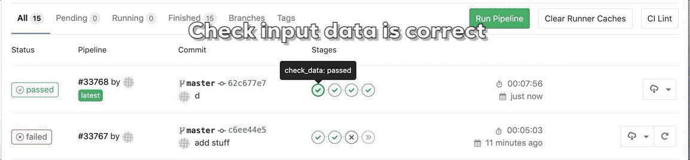

## An Example CD4ML Setup with Gitlab on AWS

[blog post not yet written, will follow with explanations etc.]



[Continuous Delivery for Machine Learning](https://www.thoughtworks.com/de/radar/techniques/continuous-delivery-for-machine-learning-cd4ml-models) is the technique of applying CD practices to machine learning which has two important underpinnings:

- we have to version the model/ it's configuration
- we also have to version the data!

There is a workshop with slides [here](https://github.com/ThoughtWorksInc/continuous-intelligence-workshop) from ThoughtWorks which explains/ describes a GoCD setup. I'm on GitLab and wanted to try this out as well, so here's what I've come up with.

Some notes:

- I did wrap most of the steps into the Makefile! Run `make help` for more info.
- We use gitlab as CI
- DVC on top of the gitlab as vc with AWS S3 as storage.
- a kaggle challenge (https://www.kaggle.com/c/kkbox-music-recommendation-challenge/data) to illustrate
  whats up in here.

This repository/ (not yet) blog post focuses on the complete
CD4ML pipeline, so I won't go into detail on gitlab YAML syntax, DVC
etc. just the bare basics. But I do link to more information if I find it appropriate.

In this tutorial/examplary repository you can walk along the whole way of a
CD4ML setup (excluding the deployment process, which I assume depends on your environment). That is:

1.  Setting up the whole pipeline which includes
1.  Setting up DVC to version data & model
1.  Setting up a gitlab pipeline to automate the execution
1.  Workflow
1.  Training everything once, and committing everything necessary
1.  Replacing the ML model with something new and training that
1.  Replacing the data with more data and running that through the pipeline.
1.  Going further
    ...

## Setup

The project uses pipenv, you simply need to run
`$ pipenv install`
to install the right python version as well as the dependencies. For reference:

- dvc
- dvc[s3] as we use AWS S3 for storage.

then run `$ pipenv shell` to enter the interactive env.

## 1. Setup DVC

(You can find an indepth intro here:
https://christophergs.github.io/machine%20learning/2019/05/13/first-impressions-of-dvc/)

Run `$ dvc init` to install dvc.

Run `$ dvc remote add -d myremote s3://YOUR_BUCKET_NAME/data`

Download the data from the kaggle challenge (https://www.kaggle.com/c/kkbox-music-recommendation-challenge/data)
into the data directory. Sorry, can't provide it,
it's only available to logged in users.

The data size is roughly 1,2-1,5 GB.

Run `$ dvc add data/`

Run `$ dvc push` to push the data to AWS S3.

(If you want more explanations on push/pull etc. for dvc, check out
the blog article linked to above.)

## 2. Create a DVC Pipeline to clean & train

A pipeline wraps things nicely together.. and checks
files for existence / change, like the cleaned data, the model,...

### 2.1 pipeline step clean

Run this once, this will both produce the output file, as well
as define one step in clean_data/preprocess.dvc

```
dvc run -f preprocess.dvc -d preprocess_data.py \
-d data/members.csv -d data/songs.csv \
    -d data/train.csv \
    -o clean_data/output.csv \
    python preprocess_data.py
```

You can try to rerun it, but it should tell you that everything
is already there.

To checkout the pipeline so far, run
`dvc pipeline show`

### 2.2 pipeline step train random forest

Now our second step depends on the output of the first one,
so we will display that dependency in our run command and then
peak at the pipeline.

```
dvc run -f train_rf.dvc -d clean_data/output.csv \
-d train_rf.py \
-o models/model_rf.pkl \
python train_rf.py
```

You can now run

```
$ dvc repro models/train_rf.dvc
```

to check that this actually worked. The "run" commands are to add
pipelines, we now have two, the repro is to run the pipeline itself (
to reproduce it's outputs
)
Try running
`$ $ dvc pipeline show --asci train_rf.dvc`
this should now display the two pipelines patched together.

One final step: Run
`dvc add models/`

to version the models with dvc as well. This is in my oppinion
really only necessary once they get too large (which unfortunately
is usually pretty quickly.)

## 3 Evaluate our model

Now that we are done with our train data and ready for the eval. data,
we have no problem also going to a second stage in gitlab.
(Gitlab CI does not allow caching between stages, only by
loading data into the configured storage and retrieving it.)

We want to evaluate the model and only push it
to production if it

- is better than the last one
- checks a bunch of sanity check

First let's setup another pipeline for evaluation which
of course includes, first preprocessing the data (in case
we updated the evaluation data by for instance including the
latest new labeled dataset, or by using the e-commerce
data from yesterday.)
, and then running
the evaluation.

```
dvc run -f preprocess_test.dvc -d preprocess_data_eval.py \
-d data/members.csv -d data/songs.csv \
    -d data/test.csv \
    -o clean_data/output_test.csv \
    python preprocess_data_eval.py
```

I decided to save the "current" baseline simply to this repository,
into "baseline.txt", which should read "0.5". Now run

`python evaluate_model.py`

to get your evaluation. It should decide the new model is better
than baseline. Then write the new baseline to baseline.txt. So
if you run it twice, it should break (The purpose being to let the
gitlab pipeline fail).

### 3.1 Sanity Checks

Sanity checks should be run after/before this to check for instance:

- That the number of predicted categories does not explode/
  is within 10% of some realistic number
- That probabilities are actually between 0-1
- That cross evaluation does not produce large outliers on some
  folds
- ... anything that will come up once you start to auto
  deploy new models on their own...

## 4 Deployment

No need to include deployment here, you can server & deploy your
model any way you like. You can take a look at the other repository
containing three easy ways to serve python based models:
https://github.com/sbalnojan/serving-ml-examples

## 5 Let's change the model

_To Do for you:_ Go ahead and exchange the RandomForest for some xgboost classifier.
Xgboost respects the scikit-learn API so you shouldn't have to make
any changes downstream...

## 6 Let's change the data

_To Do for you:_ I've simply used all train data here.

But much more interesting for your workflow should be changing
data. So:

- Go ahead and chop up the train.csv into a bunch of smaller files.
- Then add only the first file, and run all of this.
- Then go ahead and use first & second file merged together,
  run dvc push, and let the pipeline do it's work.

## 7 Automate things in gitlab

The real magic starts once we see that daily data doesn't have to
be checked in by anyone. We can simply imagine any script/lambda
function running on a daily basis that _pulls the new data_ then
merges it onto the old data and runs a dvc push, then a
git add, git push, thereby triggering the gitlab pipeline.

## 8 More GitLab

- You can get GitLab to use a GPU, either use the instance mode and
  configure your own instances as executor, or use the nvidia-gpu driver
  like so: https://gist.github.com/Hopobcn/e38726fac4da272341b0e36ef464c744
  (comments at the bottom)
- You should use a custom image to build things in gitlab, it's
  unnecessary to install pipenv etc. in every stage onto a blank python container.

## 9 More on more

Things that could be included in the automatic pipeline:

- Tensorflow Data Validation https://www.tensorflow.org/tfx/guide/tfdv: Checking for anomalies in the data, checking against a schema.
- Model productionizing in any form like compiling,
  exporting it to POJO (with H2O or similar), Caffe2,...
